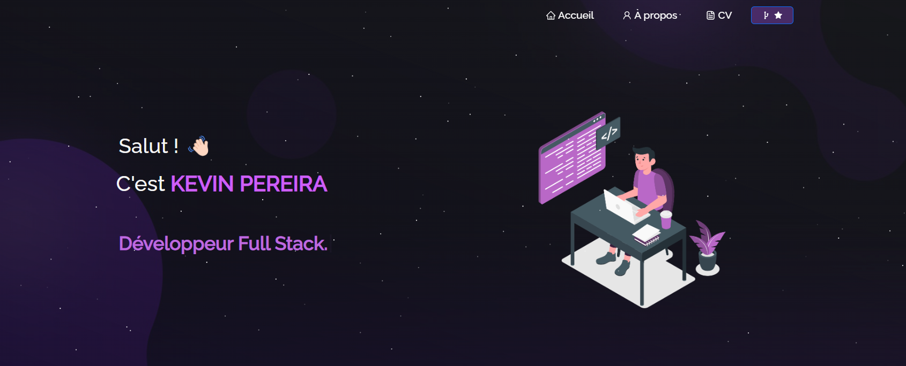

<h2 align="center">
  Portfolio 
  <a href="https://cvkevin.vercel.app/" target="_blank">kev.tech</a>
</h2>

  

 

## Résumé

Vous pouvez dupliquer ce dépôt pour le modifier et l’adapter selon vos besoins.  Merci !

## Technologies utilisées

Mon portfolio personnel [cvkevin.vercel.app](https://cvkevin.vercel.app/), qui met en avant certains de mes projets GitHub, ainsi que mon CV et mes compétences techniques.

Ce projet a été développé avec les technologies suivantes :

- React.js  
- Node.js  
- Express.js  
- CSS3  
- VsCode  
- Vercel  

## Fonctionnalités

- **📚 Mise en page multi-pages**  
- **🎨 Design moderne avec React-Bootstrap et CSS, facilement personnalisable**  
- **📱 Entièrement responsive**  

## Prise en main

Clonez ce dépôt sur votre machine. Vous aurez besoin d’installer `node.js` et `git` globalement.

## 🛠 Installation et configuration

1. Installation des dépendances : `npm install`
2. Dans le répertoire du projet, exécutez : `npm start`

L’application se lancera en mode développement.  
Ouvrez [http://localhost:3000](http://localhost:3000) dans votre navigateur pour l’afficher.  
La page se rechargera automatiquement en cas de modifications.

## Instructions d’utilisation

Ouvrez le dossier du projet et accédez à `/src/components/`.  
Vous y trouverez tous les composants utilisés et pourrez modifier les informations selon vos besoins.

### Soutenez le projet

Laissez un ⭐ si vous aimez ce site !